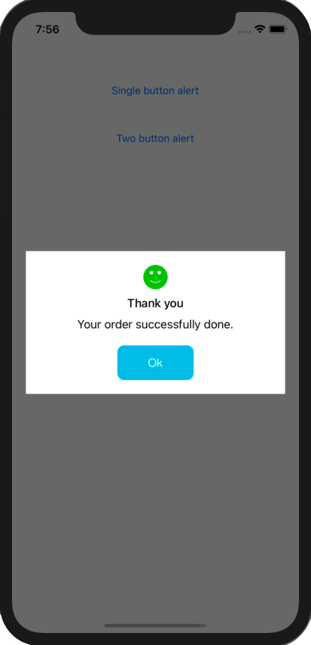
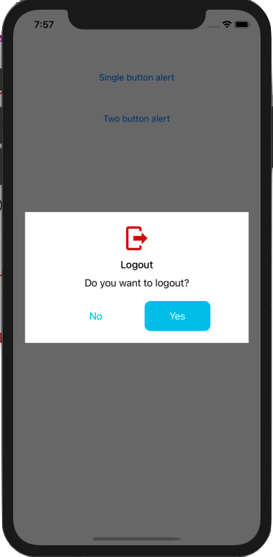

# RTCustomAlert

## Description

Custom Alert example written in swift. It uses Xib for UI design and delegate to handle Custom Alert actions.

Create a Custom Alert Controller in Swift step by step [Medium.com](https://medium.com/@rohittamkhane/create-a-custom-alert-controller-in-swift-ef5d715839f5)

## Usage

1. Download the RTCustomAlert folder
2. Drag and drop RTCustomAlert folder in your project
3. Add below code to configure and display alert

```swift
let customAlert = RTCustomAlert()
customAlert.alertTitle = "Thank you"
customAlert.alertMessage = "Your order successfully done."
customAlert.alertTag = 1
customAlert.statusImage = UIImage.init(named: "smiley")
customAlert.isCancelButtonHidden = true
customAlert.delegate = self
customAlert.show()
```

## Screenshots


